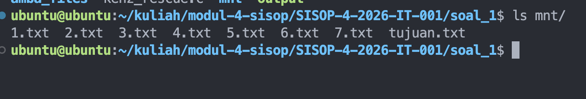
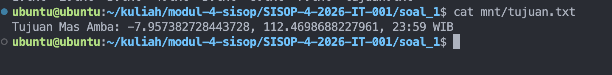
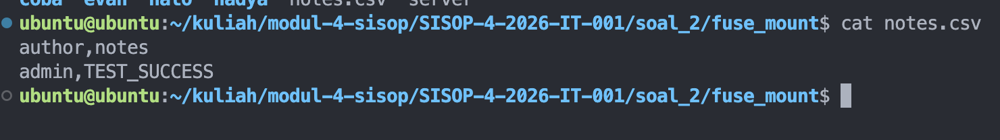
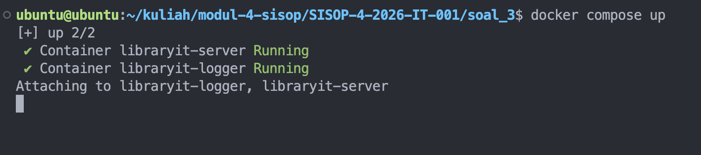

# SISOP-4-2026-IT-001

## Identitas

| No | Nama | NRP |
| --- | --- | --- |
| 1 | Evandra Raditya Fauzan | 5027251001 |

## Daftar Isi

- [SISOP-4-2026-IT-001](#sisop-4-2026-it-001)
- [Identitas](#identitas)
- [Daftar Isi](#daftar-isi)
- [Pengerjaan Soal](#pengerjaan-soal)
  - [Soal 1 - Save Asisten Kenz](#soal-1---save-asisten-kenz)
  - [Soal 2 - Poke MOO](#soal-2---poke-moo)
  - [Soal 3 - LibraryIT](#soal-3---libraryit)
- [Revisi](#revisi)

## Pengerjaan Soal

### Soal 1 - Save Asisten Kenz

Implementasi ada di file `soal_1/kenz_rescue.c`.

#### a) Menyiapkan arsip `amba_files`

- Folder sumber untuk fragmen disiapkan di `soal_1/amba_files`.
- Isi folder memuat `1.txt` sampai `7.txt` sesuai requirement soal.

#### b) FUSE passthrough untuk file nyata

Program FUSE `kenz_rescue.c` menerima argumen:

```bash
./kenz_rescue <source_directory> <mount_directory>
```

Callback yang dipakai untuk mode mirror/passthrough file nyata:

- `getattr`
- `readdir`
- `open`
- `read`
- `release`

Semua file asli (`1.txt` s.d `7.txt`) di mount point dibaca langsung dari source (byte-identical).





#### c) File virtual `tujuan.txt`

Di root mount akan selalu muncul file virtual `tujuan.txt` walaupun file fisiknya tidak ada di source.

- Di `readdir`, jika `tujuan.txt` belum ada di source, entry virtual ditambahkan manual.
- Di `getattr`, metadata `tujuan.txt` dibentuk sebagai file read-only virtual.

Hasilnya:

- `ls mnt/` berisi `1.txt` s.d `7.txt` + `tujuan.txt`.
- `ls amba_files/` tetap hanya `1.txt` s.d `7.txt`.


#### d) Generate isi `tujuan.txt` on-the-fly

Saat `cat mnt/tujuan.txt` dipanggil:

- Program membaca `1.txt` sampai `7.txt` berurutan.
- Setiap file dicari baris yang diawali prefix `KOORD:`.
- Fragmen setelah `KOORD:` digabung berurutan.
- Output dibentuk dengan format:

```text
Tujuan Mas Amba: <gabungan_fragmen>
```

Isi tidak disimpan permanen sebagai file fisik, tetapi dibangkitkan saat operasi read terjadi.



---

### Soal 2 - Poke MOO

Komponen pada folder `soal_2`:

- `fuse.c` (FUSE translator encrypted_storage <-> fuse_mount)
- `client.c` (client TCP interaktif)
- `server` (binary server release)
- `Dockerfile` (containerisasi DB service)

#### a) FUSE dengan operasi lengkap

`fuse.c` mengimplementasikan operasi yang diminta:

- `getattr`, `readdir`, `mkdir`, `rmdir`
- `create`, `open`, `read`, `write`
- `truncate`, `unlink`, `access`, `utimens`

Mount dilakukan dengan pola:

```bash
./fuse encrypted_storage fuse_mount
```

#### b) Perilaku filesystem normal dari sisi mount point

Dari sisi `fuse_mount`, user bisa:

- create file/folder
- baca/tulis file
- hapus file/folder
- lihat metadata

Semua perubahan diteruskan ke `encrypted_storage`.

#### c) Translasi enkripsi XOR (`key = 0x76`) + suffix `.enc`

Implementasi enkripsi/dekripsi dilakukan transparent:

- Data yang ditulis ke `fuse_mount` dienkripsi XOR sebelum disimpan ke source.
- Data yang dibaca dari source didekripsi XOR saat dibaca dari mount point.
- File fisik di source disimpan dengan suffix `.enc`.
- Di mount point, nama file ditampilkan tanpa `.enc`.

Contoh:

- `encrypted_storage/halo/file2.txt.enc` terlihat sebagai `fuse_mount/halo/file2.txt`.


#### d) Checker `tests/notes.csv.enc`

Sesuai instruksi, file `notes.csv.enc` ditempatkan pada direktori `tests` di source lalu dipastikan terbaca dari mount point sebagai file terdekripsi.



#### Containerization

`Dockerfile` menggunakan base `ubuntu:latest`, copy binary server ke `/app`, expose port `9000`, dan menjalankan server sebagai entrypoint container.

#### Integration (client-server)

`client.c` melakukan koneksi TCP ke server (default `127.0.0.1:9000`) dan mendukung command interaktif seperti:

- `HELP`
- `CREATE DATABASE`, `CREATE TABLE`
- `INSERT`, `SELECT`
- `LIST DATABASE`, `LIST TABLE`
- `DROP DATABASE`

---

### Soal 3 - LibraryIT

Komponen pada folder `soal_3`:

- `Dockerfile`
- `docker-compose.yml`
- `entrypoint.sh`
- `smb.conf`
- `logger.sh`

#### a) Inisialisasi server Samba otomatis

Service `libraryit-server` menyiapkan otomatis saat container start:

- Share: `ebooks`, `papers`, `sourcecode`, `docs` di `/libraryit`
- User:
  - `member:member123`
  - `contributor:contrib456`
  - `librarian:lib789`
- Group:
  - `readonly` (untuk member)
  - `staff` (untuk contributor dan librarian)

Semua dibuat dari `entrypoint.sh`, jadi tidak perlu setup manual setelah `docker-compose up`.



#### b) Aturan akses koleksi

Konfigurasi hak akses per-share diatur di `smb.conf` berbasis group/user:

- `ebooks`, `papers`: `staff` read-write, `readonly` read-only.
- `sourcecode`: hanya `staff`, `readonly` tidak boleh akses dan disembunyikan dari enumerasi share.
- `docs`: bisa dibaca sesuai rule, tapi write hanya `librarian`.
- Semua share menolak guest (`guest ok = no`).

[Screenshot Soal 3-2 - uji akses: member ditolak sourcecode, contributor ditolak write docs]

#### c) Persistensi dan proteksi host

Di `docker-compose.yml`, semua koleksi dibind ke host agar persisten.

Proteksi host:

- `data/sourcecode` di-host permission `750`.
- `data/docs` dibuat read-only dari host normal dan modifikasi diarahkan lewat Samba ACL.

Semua setting dijalankan otomatis oleh `entrypoint.sh` setelah container start.


#### d) Logging aktivitas + logger service terpisah

Sistem logging dibuat dua tahap:

1. Samba menulis log audit raw ke `/logs/samba_raw.log`.
2. Service `libraryit-logger` menjalankan `logger.sh` untuk memonitor log raw real-time, lalu memformat output ke:

```text
[YYYY-MM-DD HH:MM:SS] [LEVEL] [USERNAME] [AKSI] [NAMA FILE/SHARE]
```

Klasifikasi level:

- `INFO` untuk aktivitas normal (`ok`)
- `WARNING` untuk operasi gagal/ditolak (`fail`)

Output dapat dipantau via:

```bash
docker logs -f libraryit-logger
```

[soal3-2](./assets/soal_3/2.png)

---

## Revisi

Berikut revisi yang diterapkan pada `soal_3`:

### 1) Anonymous login dinonaktifkan

Kebutuhan revisi: akses tanpa identitas (anonymous/guest) harus ditutup.

Perubahan yang dilakukan:

- Tambah hardening global Samba di `smb.conf`:
  - `map to guest = never`
  - `restrict anonymous = 2`
  - `usershare allow guests = no`
- Tambahkan `guest ok = no` pada setiap share (`ebooks`, `papers`, `sourcecode`, `docs`).

Dampak:

- Akses koleksi wajib melalui kredensial user yang valid.
- Tidak ada akses share berbasis guest.

### 2) Menambahkan container logger terpisah

Kebutuhan revisi: harus ada service `libraryit-logger` yang bisa dipantau via `docker logs`.

Perubahan yang dilakukan:

- Menambahkan service `libraryit-logger` di `docker-compose.yml`:
  - `depends_on libraryit-server`
  - mount folder log yang sama (`./logs:/logs`)
  - menjalankan script `/usr/local/bin/logger.sh`
- Menambahkan file `logger.sh` untuk parsing log raw Samba menjadi format final soal.
- Memisahkan file log:
  - raw Samba: `/logs/samba_raw.log`
  - formatted output: `/logs/libraryit.log`
- Menyesuaikan `entrypoint.sh` agar kedua file log dibuat otomatis saat startup.

Dampak:

- Monitoring log real-time tersedia dari container logger.
- Format log sudah sesuai ketentuan soal revisi.


